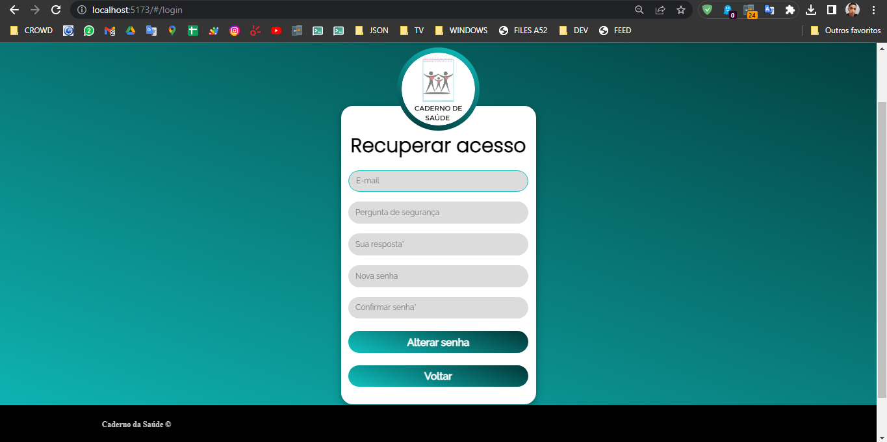

# Projeto Final : Caderno da Saúde

## Colaboradores
_**Co-facilitador: Orlando Santana**_ <div>
<a href="https://www.linkedin.com/in/orlando-santana/" target="_blank"></a><a href="https://github.com/Opseua" target="_blank"></a>
</div>

_**Gestora de Gente: Yasmim Alves**_
<div>
<a href="https://www.linkedin.com/yasmimalves" target="_blank"></a><a href="https://www.github.com/Yasmim75" target="_blank"></a>
</div> 

_**Gestor de conhecimento: Priscila Martins**_<div>
<a href="https://www.linkedin.com/priscilammc26/" target="_blank"></a><a href="https://github.com/PriscilaMMC26/" target="_blank"></a>
</div> 


_**Collab I: Gabrielly França**_ <div>
<a href="https://www.linkedin.com/gabriellyfranca810" target="_blank"></a><a href="https://www.github.com/vlwgaby" target="_blank"></a>
</div> 


 _**Collab II: Matheus Freire**_<div>
<a href="https://www.linkedin.com/in/matheus-freire-s-r/" target="_blank"></a><a href="https://www.github.com/matheuszack" target="_blank"></a>
</div>


_**Collab III: Thiago Sant' Anna**_ <div>
<a href="https://www.linkedin.com/in/thiago-de-oliveira-santanna/" target="_blank"></a><a href="https://github.com/LordTos" target="_blank"></a>
</div> 


### Projeto em Squad Resilia/Senac

### Objetivo
Nesse projeto nos foi proposto criar uma API capaz de fazer requisições e implementar todas operações CRUD.
Cada membro do squado apresentou suas ideia, apresentadas nesse repositório: https://github.com/PriscilaMMC26/Proj_indiv_final 

### Tema Escolhido
O tema escolhido foi criar um "bloco de notas" voltado para área de saúde. A ideia é que a aplicação auxilie no registro de consultas agendadas, 
horário de remédios, controle de medicamentos, cronograma de vacinação, e muito mais!

## Iniciando a Aplicação

```bash 
# Clone o repositório com git clone
$ <https://github.com/Opseua/M5-GRU_FINAL_Case-2-Site-do-Meu-app.git>

# Instale as dependências:
$ npm install

# Execute
$ npm start

Acesse <http://localhost:5173> para visualizar a aplicação
```

 ## Endpoints

```bash 
https://m5-gru-crud-api.cyclic.app/usuarios
⚡GET → Lista todos os 'usuarios'
⚡POST → Adiciona um 'usuario'
⚡PUT/:id → Edita um 'usuario'
⚡DELETE/:id → Deleta um 'usuario'
```

```bash 
https://m5-gru-crud-api.cyclic.app/notas
⚡GET → Lista todos as 'notas'
⚡POST → Adiciona uma 'nota'
⚡PUT/:id → Edita uma 'nota'
⚡DELETE/:id → Deleta uma 'nota'
```

```bash 
https://m5-gru-crud-api.cyclic.app/perguntas
⚡GET → Lista todos as 'perguntas'
⚡POST → Adiciona uma 'pergunta'
⚡PUT/:id → Edita uma 'pergunta'
⚡DELETE/:id → Deleta uma 'pergunta'
```

```bash 
https://m5-gru-crud-api.cyclic.app/comunicados
⚡GET → Lista todos os 'comunicados'
⚡POST → Adiciona um 'comunicado'
⚡PUT/:id → Edita um 'comunicado'
⚡DELETE/:id → Deleta um 'comunicado'
```

```bash 
https://m5-gru-crud-api.cyclic.app/adm/sobre
⚡GET → Lista todos os 'sobre'
⚡POST → Adiciona um 'sobre'
⚡PUT/:id → Edita um 'sobre'
⚡DELETE/:id → Deleta um 'sobre'
```

```bash 
https://m5-gru-crud-api.cyclic.app/adm/funcionalidades
⚡GET → Lista todos as 'funcionalidades'
⚡POST → Adiciona uma 'funcionalidade'
⚡PUT/:id → Edita uma 'funcionalidade'
⚡DELETE/:id → Deleta uma 'funcionalidade'
```


⚡⚡⚡ LINKS DE ACESSO ⚡⚡⚡

```bash 
INCIO → http://localhost:5173/#
```


```bash 
SOBRE → http://localhost:5173/#/sobre
```


```bash 
FUNCIONALIDADES → http://localhost:5173/#/funcionalidades
```


```bash 
COMUNICADOS → http://localhost:5173/#/funcionalidades
```


```bash 
LOGIN → http://localhost:5173/#/login
```


```bash 
REDEFINIR SENHA → http://localhost:5173/#/login
```



```bash 
CADASTRO → http://localhost:5173/#/login
```


```bash 
NOTAS (feed) → http://localhost:5173/#/feed
```

```bash 


```bash 
NOTAS (edit) → http://localhost:5173/#/edit/:id
```

```bash 


```bash 
NOTAS (ler mais) → http://localhost:5173/#/lermais/:id
```

```bash 


```bash 
NOTAS (criar) → http://localhost:5173/#/post
```

```bash 


```bash 
PERFIL → http://localhost:5173/#/perfil
```


